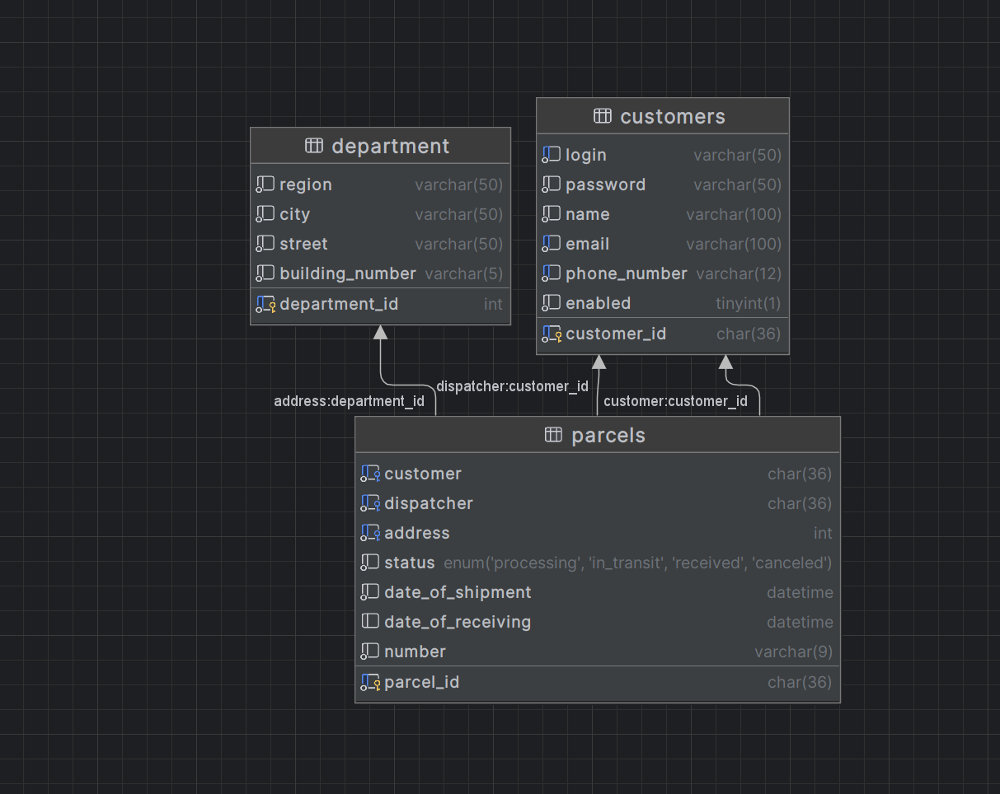
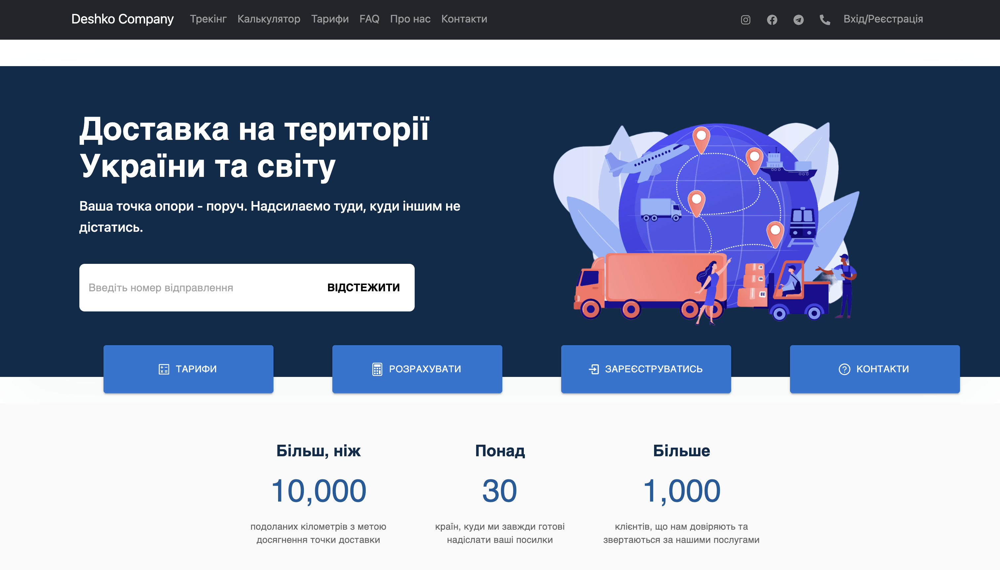

# 
# Deshko Company
<table>
<tr>
<td>
  ФОП "Дешко Н. П." є сучасною та інноваційною компанією, яка спеціалізується в сфері перевезень та доставки. Компанія надає широкий спектр послуг, включаючи вантажні перевезення, кур'єрську доставку, логістичні рішення та багато іншого.
</td>
</tr>
</table>

## Figma
```figma
https://www.figma.com/file/TJspv3a5YRjPSLr22w1oBm/Deshko-Project?type=design&node-id=0-1&mode=design&t=mqkMBleMngFpxk7P-0
```

## Testing DataBase Structure



## Site

### Pages
* Main
* Tracking
* Calculator
* Prices
* FAQ
* About
* Contact
* SignIn/SignUp
* User Cabinet

### Landing Page



## Built with 
- [React](https://uk.legacy.reactjs.org/) - front.
- [Java Spring Boot](https://spring.io/) - back.
- [Material-UI](https://mui.com/) - UI library.

## Team

[Viktoria Syrotynska](https://github.com/bittersweet-01) | [Erik Toroni](https://github.com/FantomFromUA)